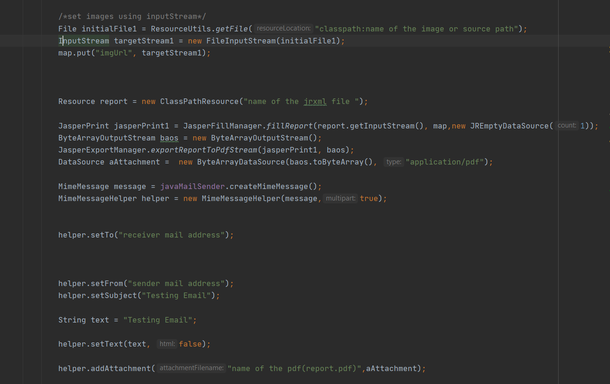

<h2>This is sample project that created by me to achieve my task.</h2> 
<h3>Task</h3>
<ul>
<li>able to generate a jasper report</li>
<li>All the images in the document should set through the input stream</li>
<li>after report was generated that report should be mail automatically to given mail address</li>
<li>that document should be sent as an attachment</li>
</ul>

 

<h3>Tech stack</h3>
<ul>
<li>Spring Boot</li>
<li>Jasper studio 6.20.0</li>
</ul>

 

__developed by charith__